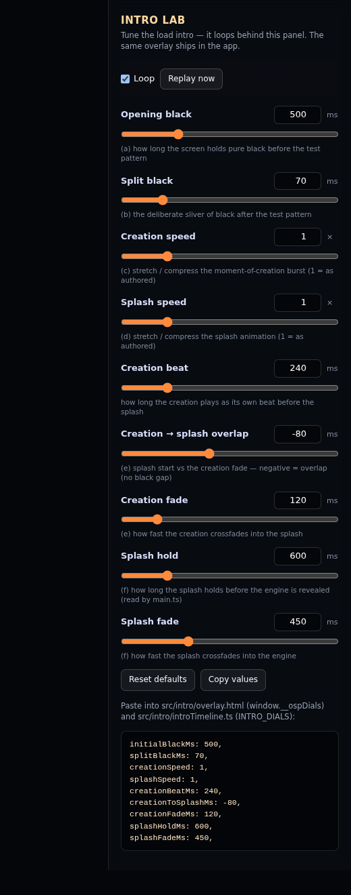

<h1 align="center">One Still Point</h1>

<p align="center"><em>The worldline · The present resting place</em></p>

<p align="center">
  
</p>

<p align="center"><strong>Created by Chris&nbsp;Portka</strong></p>

<p align="center"><em>The circle of eternal return · The spinning cycle of time</em></p>

<p align="center"><a href="https://onestillpoint.app"><strong>onestillpoint.app</strong></a></p>

A scientifically grounded, GPU-accelerated, animated **black hole and spacetime visualizer** that
runs in the browser — event-horizon shadow, photon ring, gravitationally lensed
background, and a live relativistic accretion disk. Built on WebGPU (with an
automatic WebGL2 fallback) and architected to grow into a general gravitational
N-body simulator.

---

## Features

- **Ray-traced Schwarzschild black hole** — event-horizon shadow, photon ring and
  gravitational lensing from per-pixel photon geodesics (RK4 integration of the
  Schwarzschild metric), with an automatic WebGL2 fallback.
- **Live relativistic accretion disk** — Shakura–Sunyaev temperature → blackbody
  colour, Doppler beaming and gravitational redshift, over volumetric, turbulent,
  infalling dust — a participating medium sampled *inside* the raymarch, so it
  lenses correctly along the bent rays.
- **Gravitational N-body companions** — stars, planets and up to four secondary
  black holes (each with its own lensed accretion disk), simulated and raymarched
  inside the hole's curved spacetime, so they lens and are occluded for free.
- **Time control** — scrub from ×1/1000 slow-motion to ×1,000,000. Rather than
  brute-forcing the dynamics, the *representation* crossfades: orbits accelerate
  (bounded) and the fine turbulence averages into a steady disk.
- **Selectable lensed skies** — Stars, Nebula, Filaments, Lattice — each
  post-tunable for brightness / saturation / tint.
- **Art-directed intro** — a scripted and tuned moment of
  creation and binary star merger intro (all painting before the
  shader even compiles), crossfading into a camera dolly + disk ignition. **Replay**
  melts the live view and plays it all again.
- **Filters & polish** — named looks (Physical / EHT / Interstellar / Stylized),
  HDR bloom, adaptive resolution, and a touch-friendly control panel.

Drag to orbit · pinch / scroll to zoom · open the panel (top-right) to add bodies,
change the sky, scrub time, and tune the look. Keyboard (press **?** for the full
list): **Esc** About · **Space** Pause/Resume · **← / →** Step back / forward ·
**↑ / ↓** double / halve Speed · **R** Replay · **C** Clear · **F** HUD.

## Moment of creation

<p align="center">
  
</p>

The intro opens on the **moment of creation**: a seed ignites at a still point and
everything outward before folding back to black. Pure CSS (no canvas), instant and
identical on every device.

Captured from:
[`scripts/capture-creation.mjs`](scripts/capture-creation.mjs) (`npm run
capture:creation`) — re-run it whenever the burst changes to refresh
[`assets/creation.gif`](assets/creation.gif).

## Splash

<p align="center">
  
</p>

A tiny, art-directed **binary-merger splash** — all painting before WebGPU, no blank
screen. Two warm stars spiral together through a field of drifting dust, flash and merge,
and the new event horizon settles inside an accretion ring as neon shock waves reverberate
outward — crossfade to the live, formed black hole. Plain CSS + one `<canvas>` layer (no engine),
targets 200 fps, and starts on the first painted frame so plays in full on mobile. The
full beat-by-beat storyboard (and the screenplay) lives in
[`docs/intro-script.md`](docs/intro-script.md).

Captured from:
[`scripts/capture-splash.mjs`](scripts/capture-splash.mjs) (`npm run
capture:splash`) — re-run it whenever the splash changes to refresh
[`assets/splash.gif`](assets/splash.gif).

## Tuning the intro

The whole intro — the moment of creation, the splash, the Replay melt, and its
stylesheet — lives as **one self-contained, forkable unit** under
[`src/intro/`](src/intro/) ([`overlay.html`](src/intro/overlay.html) markup + inline boot
script, [`intro.css`](src/intro/intro.css), [`introTimeline.ts`](src/intro/introTimeline.ts),
[`lab.ts`](src/intro/lab.ts), [`melt.ts`](src/intro/melt.ts)). A tiny Vite plugin inlines
the overlay into both the app (`index.html`) and a dev-only **intro lab**, so the lab
always previews the *exact* intro the site ships. The integration contract and a
`git filter-repo` recipe for lifting it into its own repo are in
[`src/intro/README.md`](src/intro/README.md).

<p align="center">
  
</p>

```bash
npm run dev    # then open http://localhost:5173/intro-lab.html
```

The lab loops the intro behind a panel of sliders bound live to `window.__ospDials`, so
every adjustment to the visual sequence is visible within a cycle (or hit **Replay now**).
When a look feels right, **Copy values** and paste the snippet into
[`src/intro/overlay.html`](src/intro/overlay.html) (`window.__ospDials`) and
[`src/intro/introTimeline.ts`](src/intro/introTimeline.ts) (`INTRO_DIALS`) — a unit test
keeps those two in lockstep. The dials, in play order:

| Dial | Default | What it does |
| --- | --- | --- |
| Opening black | 500 ms | how long the screen holds pure black before the test pattern |
| Split black | 70 ms | the deliberate sliver of black after the one-frame test pattern |
| Creation speed | 1× | stretch / compress the moment-of-creation burst (1 = as authored) |
| Splash speed | 1× | stretch / compress the splash animation (1 = as authored) |
| Creation beat | 240 ms | how long the creation plays as its own beat before the splash |
| Creation → splash overlap | −80 ms | when the splash starts vs the creation fade (negative = overlap, no black gap) |
| Creation fade | 120 ms | how fast the creation crossfades into the splash |
| Splash hold | 600 ms | how long the splash holds before the engine is revealed (read by `main.ts`) |
| Splash fade | 450 ms | how fast the splash crossfades into the engine |

The lab isn't part of the production build (`intro-lab.html` isn't a Vite input), but
its controller [`src/intro/lab.ts`](src/intro/lab.ts) is typechecked and linted with the
rest of `src`.

## Project status

Actively developed in small, themed phases. See **[CHANGELOG.md](CHANGELOG.md)**
for the full version history, **[`docs/future-improvements.md`](docs/future-improvements.md)**
for the roadmap, and **[`docs/`](docs/)** for design and tuning notes (the intro
script, screen-recording findings, and performance audits).

## Stack

- **TypeScript** + **Vite**
- **Three.js r184** via `three/webgpu` (`WebGPURenderer`, auto WebGL2 fallback)
- **TSL** (`three/tsl`) — one shader source compiles to both WGSL and GLSL
- **OrbitControls** for swipe-orbit / pinch-zoom
- **lil-gui** for the control panel

## Develop

Requires Node 20.19+ or 22.12+.

```bash
npm install
npm run dev        # http://localhost:5173 (a secure context, so WebGPU works)
```

```bash
npm run lint       # eslint
npm run typecheck  # tsc --noEmit
npm test           # vitest (unit tests for the physics)
npm run validate   # CPU physics checks (geodesic / disk / orbit / lensing)
npm run build      # typecheck + vite build → dist/
npm run preview    # serve the production build locally
```

Lint, typecheck, tests, and the validation scripts run in CI
(`.github/workflows/ci.yml`) on every push to `main` and every pull request.

Append **`?webgl`** to the URL to force the WebGL2 fallback path for testing
(e.g. `http://localhost:5173/?webgl`).

## Architecture

The camera is an *input device only*. We render a single fullscreen quad and feed
the orbit camera's position/orientation into the raymarch shader as uniforms each
frame. A guiding constraint: the infalling dust is a **volumetric participating
medium** sampled inside the raymarch, never rasterized particles — only that way
does it lens correctly along the bent light rays.

```
src/
  main.ts              bootstrap: wire uniforms → camera/loop/pass → render loop
  core/
    Renderer.ts        WebGPURenderer + automatic WebGL2 fallback
    CameraRig.ts       PerspectiveCamera + OrbitControls → camera uniforms; intro dolly driver
    Loop.ts            requestAnimationFrame driver → real frame delta
    TimeController.ts  decouples sim time from wall-clock: scale / pause / step ± / crossfade
    History.ts         zero-alloc ring buffer of body states — foundation for a scrub bar
    FormationSequence.ts  the intro: camera dolly + disk "ignition" (skip / replay / reduced-motion)
    ResolutionScaler.ts  adaptive drawing-buffer scale from frame time
    quality.ts         device-tier auto-detect (resolution / dust step / DPR cap)
    device.ts          coarse-pointer / reduced-motion probes (framing, tooltips, intro)
  scene/
    Scene.ts           owns the Body list + PhysicsEngine; spawns companions; prune/absorb/plunge
    Body.ts            a gravitating body (hole / star / planet)
    BlackHole.ts       the hole's parameters as uniforms (mass = length scale)
  physics/
    PhysicsController.ts  switches CPU/GPU integrators behind one step(dt)
    PhysicsEngine.ts   N-body integrator driver (CPU velocity-Verlet, adaptive substeps)
    integrators.ts     velocity-Verlet + Newtonian accelerations
    GPUPhysicsEngine.ts  opt-in WebGPU compute N-body (storage buffers + kernels)
  ui/
    Controls.ts        lil-gui panel (lazy-loaded, mounted at idle off the splash); also the persistence wiring
    settings.ts        one localStorage profile — every control auto-saves / auto-loads
    keybindings.ts     keyboard shortcuts (Esc About · ? help · Space Pause · ←/→ Step · ↑/↓ Speed · R/C/F)
    shortcuts.ts       the "?" keyboard-shortcuts cheat-sheet overlay
    presets.ts         named looks / "filters" (Physical / EHT / Interstellar / Stylized)
    stepper.ts         the Bodies "− N +" add/remove rows (✓/✗ flash)
    about.ts           the About modal (author, project link, donations, privacy, animated logo)
    share.ts           the Share button: hand the last ~5s clip to the OS share sheet, else download it
    clipRecorder.ts    rolling ~5s 720² mp4 buffer of the canvas (WebCodecs H.264 → mp4-muxer; the Share clip source)
    touchTooltips.ts   long-press tooltips for touch devices (no native hover)
    versionBadge.ts    click-to-copy version chip
    hud.ts             lower-left HUD: FPS + frame-time graph + resolution + debug detail
  render/
    uniforms.ts        the shared uniform "bus" (camera, time, background, resolution)
    RaymarchPass.ts    fullscreen quad + node material (the colour node plugs in here)
    PostPipeline.ts    WebGPU node pipeline: HDR bloom → ACES tone-map
    bodyUniforms.ts    companion render slots (position / radius / colour / appear / absorb)
    tsl/
      raymarch.ts      geodesic loop + volume march + body spheres + secondary-hole disk
      schwarzschild.ts photon acceleration + static-observer ray (the metric)
      disk.ts          flux/temperature profile + Doppler & redshift shift
      medium.ts        volumetric dust: density, emission, scatter, extinction
      secondaryDisk.ts compact accretion disk around an added (secondary) black hole
      flow.ts          Keplerian Ω(r) + advected (co-rotating) noise coordinate
      turbulence.ts    fractal (FBM) noise
      blackbody.ts     temperature (K) → linear RGB
      bodies.ts        segment–sphere / stretched-ellipsoid tests for companions
      starfield.ts     procedural lensed star field
      background.ts    selectable sky (Stars / Nebula / Filaments / Lattice), all lensed
index.html             inlines the shared intro overlay (the @osp-intro-overlay marker) and defers the engine bundle
intro-lab.html         dev-only intro lab: loop + tune the intro (npm run dev → /intro-lab.html); never shipped
vite.config.ts         build config + the introOverlay() plugin that inlines overlay.html into both HTML entries
src/intro/             the intro as one self-contained, forkable unit (its own README.md + filter-repo recipe):
                       overlay.html (source of truth — markup + inline boot script, inlined by the plugin above),
                       intro.css (all the intro styles, linked separately), introTimeline.ts (timing, mirrored by
                       the inline dials), lab.ts (the lab's sliders + loop), melt.ts (the Replay melt)
scripts/
  validate-*.mjs       CPU physics checks (geodesic / disk / orbit / lensing) — npm run validate
  capture-splash.mjs   render the load splash to assets/splash.gif — npm run capture:splash
  capture-creation.mjs render the moment of creation to assets/creation.gif — npm run capture:creation
  verify-intro.mjs     headless visual test of the intro prelude beats — npm run verify:intro
assets/                tracked art: hero.svg (logo) + creation.gif + splash.gif (captured intro loops) + intro-lab.png
```

## Deploy

Pushing to `main` triggers `.github/workflows/deploy.yml`, which builds with Vite
and publishes `dist/` to GitHub Pages. The custom apex domain is set in
**Settings → Pages → Custom domain** (`onestillpoint.app`); with artifact-based
deploys no committed `CNAME` file is needed. `vite.config.ts` uses `base: '/'`
because the site serves from the domain root.

## License

[MIT](./LICENSE) © 2026 Chris Portka. Bundled environment assets (star cubemaps /
HDRIs), if any, retain their own licenses.
