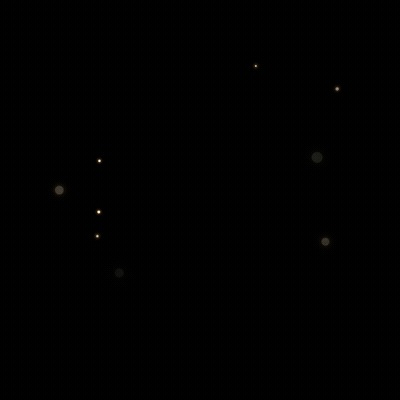

<h1 align="center">One Still Point</h1>

<p align="center"><em>The worldline · The present resting place</em></p>

<p align="center">
  
</p>

<p align="center"><strong>Created by Chris&nbsp;Portka</strong></p>

<p align="center"><em>The circle of eternal return · The spinning cycle of time</em></p>

<p align="center">🌐 <a href="https://onestillpoint.app"><strong>onestillpoint.app</strong></a></p>

A scientifically grounded, GPU-accelerated, animated **black hole visualizer** that
runs in the browser — event-horizon shadow, photon ring, gravitationally lensed
background, and a live relativistic accretion disk. Built on WebGPU (with an
automatic WebGL2 fallback) and architected to grow into a general gravitational
N-body simulator.

---

## Features

- **Ray-traced Schwarzschild black hole** — event-horizon shadow, photon ring and
  gravitational lensing from per-pixel photon geodesics (RK4 integration of the
  Schwarzschild metric), with an automatic WebGL2 fallback.
- **Live relativistic accretion disk** — Shakura–Sunyaev temperature → blackbody
  colour, Doppler beaming and gravitational redshift, over volumetric, turbulent,
  infalling dust — a participating medium sampled *inside* the raymarch, so it
  lenses correctly along the bent rays.
- **Gravitational N-body companions** — stars, planets and up to four secondary
  black holes (each with its own lensed accretion disk), simulated and raymarched
  inside the hole's curved spacetime, so they lens and are occluded for free.
- **Time control** — scrub from ×1/1000 slow-motion to ×1,000,000. Rather than
  brute-forcing the dynamics, the *representation* crossfades: orbits accelerate
  (bounded) and the fine turbulence averages into a steady disk.
- **Selectable lensed skies** — Stars, Nebula, Filaments, Lattice — each
  post-tunable for brightness / saturation / tint.
- **Art-directed intro** — a colourful binary-merger load splash that paints
  instantly (before the shader even compiles), crossfading into a camera dolly +
  disk ignition.
- **Filters & polish** — named looks (Physical / EHT / Interstellar / Stylized),
  HDR bloom, adaptive resolution, and a touch-friendly control panel.

Drag to orbit · pinch / scroll to zoom · open the panel (top-right) to add bodies,
change the sky, scrub time, and tune the look. Keyboard (press **?** for the full
list): **Esc** About · **Space** Pause/Resume · **← / →** Step back / forward ·
**↑ / ↓** double / halve Speed · **R** Replay · **C** Clear · **F** FPS.

## Splash

<p align="center">
  
</p>

The app opens on a tiny, art-directed **binary-merger splash** that paints
*instantly* — before the WebGPU shader even compiles — so there's never a blank
screen. Two warm stars spiral together through a field of drifting dust, flash and
merge, and the new event horizon settles inside an accretion ring as neon shock
waves reverberate outward — then it crossfades into the live, formed black hole.
It's plain CSS + one `<canvas>` layer (no engine), and it starts on the first
painted frame so it plays in full on mobile too.

The animation above is captured straight from the running splash by
[`scripts/capture-splash.mjs`](scripts/capture-splash.mjs) (`npm run
capture:splash`) — re-run it whenever the splash changes to refresh
[`assets/splash.gif`](assets/splash.gif).

## Project status

Actively developed in small, themed phases. See **[CHANGELOG.md](CHANGELOG.md)**
for the full version history, **[`docs/future-improvements.md`](docs/future-improvements.md)**
for the roadmap, and **[`docs/`](docs/)** for design and tuning notes (the intro
script, screen-recording findings, and performance audits).

## Stack

- **TypeScript** + **Vite**
- **Three.js r184** via `three/webgpu` (`WebGPURenderer`, auto WebGL2 fallback)
- **TSL** (`three/tsl`) — one shader source compiles to both WGSL and GLSL
- **OrbitControls** for swipe-orbit / pinch-zoom
- **lil-gui** for the control panel

## Develop

Requires Node 20.19+ or 22.12+.

```bash
npm install
npm run dev        # http://localhost:5173 (a secure context, so WebGPU works)
```

```bash
npm run lint       # eslint
npm run typecheck  # tsc --noEmit
npm test           # vitest (unit tests for the physics)
npm run validate   # CPU physics checks (geodesic / disk / orbit / lensing)
npm run build      # typecheck + vite build → dist/
npm run preview    # serve the production build locally
```

Lint, typecheck, tests, and the validation scripts run in CI
(`.github/workflows/ci.yml`) on every push to `main` and every pull request.

Append **`?webgl`** to the URL to force the WebGL2 fallback path for testing
(e.g. `http://localhost:5173/?webgl`).

## Architecture

The camera is an *input device only*. We render a single fullscreen quad and feed
the orbit camera's position/orientation into the raymarch shader as uniforms each
frame. A guiding constraint: the infalling dust is a **volumetric participating
medium** sampled inside the raymarch, never rasterized particles — only that way
does it lens correctly along the bent light rays.

```
src/
  main.ts              bootstrap: wire uniforms → camera/loop/pass → render loop
  core/
    Renderer.ts        WebGPURenderer + automatic WebGL2 fallback
    CameraRig.ts       PerspectiveCamera + OrbitControls → camera uniforms; intro dolly driver
    Loop.ts            requestAnimationFrame driver → real frame delta
    TimeController.ts  decouples sim time from wall-clock: scale / pause / step ± / crossfade
    FormationSequence.ts  the intro: camera dolly + disk "ignition" (skip / replay / reduced-motion)
    ResolutionScaler.ts  adaptive drawing-buffer scale from frame time
    quality.ts         device-tier auto-detect (resolution / dust step / DPR cap)
    device.ts          coarse-pointer / reduced-motion probes (framing, tooltips, intro)
  scene/
    Scene.ts           owns the Body list + PhysicsEngine; spawns companions; prune/absorb/plunge
    Body.ts            a gravitating body (hole / star / planet)
    BlackHole.ts       the hole's parameters as uniforms (mass = length scale)
  physics/
    PhysicsController.ts  switches CPU/GPU integrators behind one step(dt)
    PhysicsEngine.ts   N-body integrator driver (CPU velocity-Verlet, adaptive substeps)
    integrators.ts     velocity-Verlet + Newtonian accelerations
    GPUPhysicsEngine.ts  opt-in WebGPU compute N-body (storage buffers + kernels)
  ui/
    Controls.ts        lil-gui panel: Filter / Speed / Bodies up front, deep tuning behind Advanced
    keybindings.ts     keyboard shortcuts (Esc About · ? help · Space Pause · ←/→ Step · ↑/↓ Speed · R/C/F)
    shortcuts.ts       the "?" keyboard-shortcuts cheat-sheet overlay
    presets.ts         named looks / "filters" (Physical / EHT / Interstellar / Stylized)
    prefs.ts           remembered UI prefs (advanced on/off, tap-outside-close) via localStorage
    stepper.ts         the Bodies "− N +" add/remove rows (✓/✗ flash)
    about.ts           the About modal (author, project link, donations, animated logo)
    touchTooltips.ts   long-press tooltips for touch devices (no native hover)
    versionBadge.ts    click-to-copy version chip
    hud.ts             corner FPS readout, toggled by "Display FPS"
  render/
    uniforms.ts        the shared uniform "bus" (camera, time, background, resolution)
    RaymarchPass.ts    fullscreen quad + node material (the colour node plugs in here)
    PostPipeline.ts    WebGPU node pipeline: HDR bloom → ACES tone-map
    bodyUniforms.ts    companion render slots (position / radius / colour / appear / absorb)
    tsl/
      raymarch.ts      geodesic loop + volume march + body spheres + secondary-hole disk
      schwarzschild.ts photon acceleration + static-observer ray (the metric)
      disk.ts          flux/temperature profile + Doppler & redshift shift
      medium.ts        volumetric dust: density, emission, scatter, extinction
      secondaryDisk.ts compact accretion disk around an added (secondary) black hole
      flow.ts          Keplerian Ω(r) + advected (co-rotating) noise coordinate
      turbulence.ts    fractal (FBM) noise
      blackbody.ts     temperature (K) → linear RGB
      bodies.ts        segment–sphere / stretched-ellipsoid tests for companions
      starfield.ts     procedural lensed star field
      background.ts    selectable sky (Stars / Nebula / Filaments / Lattice), all lensed
index.html             also hosts the inline, instant-paint load splash (window.__ospSplash)
scripts/
  validate-*.mjs       CPU physics checks (geodesic / disk / orbit / lensing) — npm run validate
  capture-splash.mjs   render the load splash to assets/splash.gif — npm run capture:splash
assets/                tracked art: hero.svg (logo) + splash.gif (captured intro loop)
```

## Deploy

Pushing to `main` triggers `.github/workflows/deploy.yml`, which builds with Vite
and publishes `dist/` to GitHub Pages. The custom apex domain is set in
**Settings → Pages → Custom domain** (`onestillpoint.app`); with artifact-based
deploys no committed `CNAME` file is needed. `vite.config.ts` uses `base: '/'`
because the site serves from the domain root.

## License

[MIT](./LICENSE) © 2026 Chris Portka. Bundled environment assets (star cubemaps /
HDRIs), if any, retain their own licenses.
